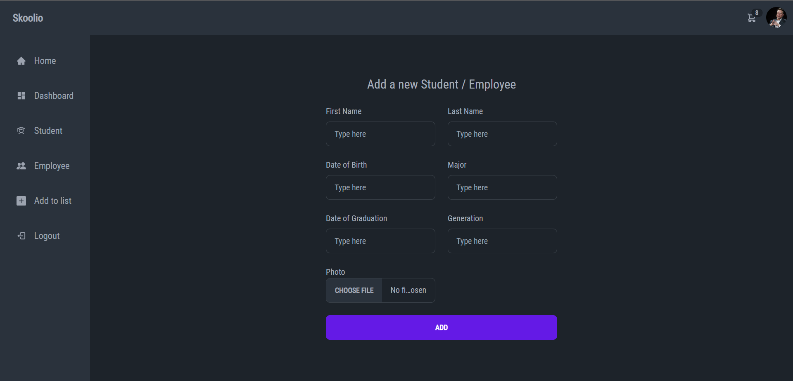

Skoolio - School management system .

This is a school management system built using the MERN (MongoDB, Express.js, React.js, Node.js) stack. It provides a variety of features, including:

Adding and managing students and teachers
Deleting students
Editing student information
User role and permission management
Photo upload
Attendance marking
Mass messaging to students
Assigning marks and grades
Development commands

Node.js

npm install
npm start
React.js

npm install
npm start
Features

Adding and managing students and teachers: You can add new students and teachers to the database, and edit their information as needed.
Deleting students: You can delete students from the database, but this action is permanent.
Editing student information: You can edit any aspect of a student's information, such as their name, contact information, and grades.
User role and permission management: You can create and manage user roles, and assign permissions to each role. This allows you to control what users can and cannot do in the system.
Photo upload: You can upload photos of students and teachers to the system. These photos can be used in a variety of ways, such as on student IDs and in class lists.
Attendance marking: You can mark student attendance for each class. This data can be used to track student attendance and identify any students who may be at risk of falling behind.
Mass messaging to students: You can send mass messages to all students, or to specific groups of students. This is a useful way to communicate with students about important announcements or events.
Assigning marks and grades: You can assign marks and grades to students for each class. This data can be used to track student progress and generate reports.
Getting started

To get started with this project, clone the repository and install the dependencies:

git clone https://github.com/your-username/school-management-system.git
cd school-management-system
npm install
Once the dependencies have been installed, you can start the Node.js and React.js servers:

npm start
The Node.js server will run on port 5000, and the React.js server will run on port 3000. You can then open your web browser and navigate to http://localhost:3000 to access the application.

Usage

To use the application, you will need to create an account and log in. Once you are logged in, you will be able to access all of the features of the system.

To add a new student or teacher, simply click on the "Add Student" or "Add Teacher" button and enter the relevant information. To delete a student, click on the "Delete" button next to the student's name. To edit student information, click on the "Edit" button next to the student's name.

To manage user roles and permissions, click on the "User Roles" tab. From here, you can create new roles, edit existing roles, and assign permissions to each role.

To upload a photo, click on the "Upload Photo" button next to the student's or teacher's name. To mark attendance, click on the "Mark Attendance" tab. From here, you can select the class and date for which you want to mark attendance, and then mark the attendance for each student.

To send a mass message to students, click on the "Mass Messaging" tab. From here, you can enter the message you want to send and select the group of students you want to send it to.

To assign marks and grades to students, click on the "Marks and Grades" tab. From here, you can select the class and assignment for which you want to assign marks and grades, and then enter the marks and grades for each student.

Conclusion

This school management system provides a variety of features to help you manage your school more efficiently. It is easy to use and can be customized to meet the specific needs of your school.